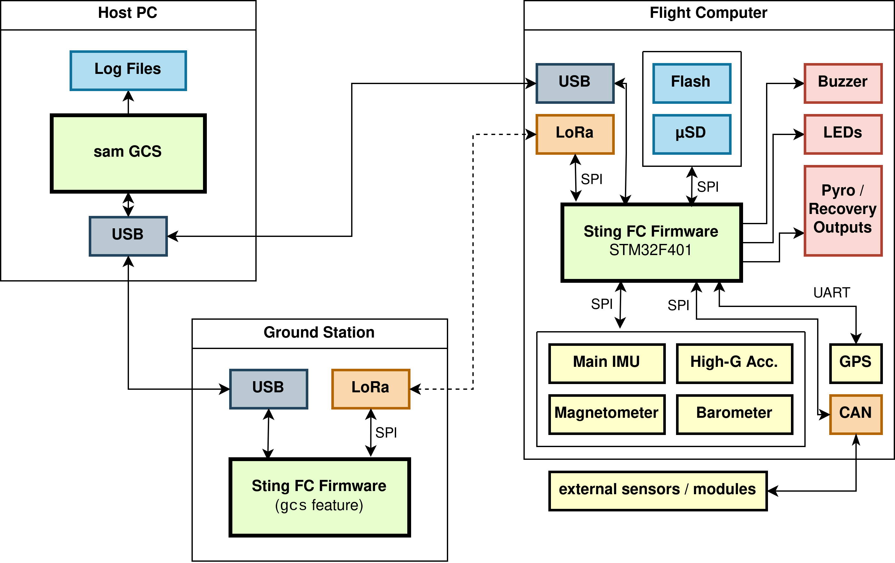

mithril
=======

Firmware for the Sting flight computer.



# Setup

## STLink drivers

**Linux**: Install via package manager if possible, e.g. `pacman -S stlink`

**Windows**:
- Download drivers from [ST's website](https://www.st.com/en/development-tools/stsw-link009.html) (requires account)
- Extract .zip and run `dpinst_amd64.exe` for 64-bit systems, and `dpinst_x86.exe` on 32-bit systems.

After installation, it *may* be necessary to unplug the STLink and plug it back in, or even reboot (or reload udev rules on Linux).

## DFU drivers

**Linux**: N/A

**Windows**: You may have to install additional drivers to talk to the DFU bootloader. To do this:
- Download and run the driver installation tool [Zadig](https://zadig.akeo.ie/)
- Click Option > List All Devices
- Select "STM32 BOOTLOADER"
- Click "Replace Driver", and wait for installation to finish

## DFU tools

**Linux**: Install via package manager if possible, e.g. `pacman -S dfu-util`

**Windows**:
- Download [dfu-util 0.9](http://dfu-util.sourceforge.net/releases/dfu-util-0.9-win64.zip)
- Extract .zip and copy dfu-util.exe and libusb-1.0.dll to the project folder

## Rustup

A tool used to manage different Rust versions and targets (e.g. x86, ARM, etc.). Download and run installer: follow the instructions on https://rustup.rs/ (Use rustup-init.exe for Windows, defaults are fine)

## Rust

Using `rustup`, we can download the target needed for the STM32 and some other tools we need.

Run the following commands (you can skip ones needed for flashing methods you're not interested in):
- `rustup toolchain install nightly --target thumbv7em-none-eabihf` (nightly ARM toolchain)
- `rustup component add --toolchain nightly llvm-tools-preview` (Needed for DFU flashing)
- `cargo install cargo-embed` (Needed for SWD flashing)
- `cargo install cargo-binutils` (Needed for DFU flashing)
- `cargo install cargo-make` (Main task runner)
- `cargo install probe-run` (Needed for cargo run)
- `cargo install flip-link` (Needed for cargo run)

## Sam Ground Station

Once Rust is installed, install [Sam](https://github.com/tudsat-rocket/sam).

# Compiling & Flashing

## Serial Wire Debug (SWD)

This method requires an STLink v2 programmer, connected to the FC via the SWD header. To compile and flash the firmware:

```
cargo make swd
```

For this method is is irrelevant if the STM32 is in bootloader mode.

## Device Firmware Update (DFU) via USB

This method only requires a USB connection.

```
cargo make dfu
```

Flashing via DFU requires the STM32 to be in bootloader mode. The above command will attempt to establish a serial connection to the STM32 and request a reboot to bootloader, but this may fail. To manually reboot the FC into the bootloader, hold the "BOOT" button down while pressing the "RESET" button once.
